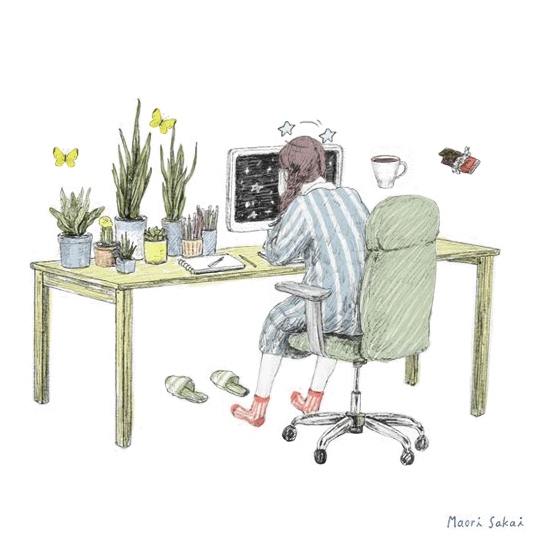

<h1 align = "center"> hi, i'm daniella💛 </h1>

  

<h2> about me </h2>
<ul>
  <li>I'm a Jr. Software QA Engineer 👩‍💻 </li>
  <li>I'm currently learning the fundamentals of software testing from <a href="https://www.youtube.com/playlist?list=PLL34mf651faM_nn8uKlnwbQPw5zSh_F84" target="_blank">Software Testing Mentor</a></li>
  <li>Also learning "Complete Web & Mobile Designer in 2023: UI/UX, Figma, +more" on Udemy ☕</li>
  <li>Currently I'm reading "Atomic Habits" by James Clear📚</li>
</ul>

<h2> languages and tools </h2>

  

  

  

  

  

  

  

  

  

  

<!--
**newtechnovice/newtechnovice** is a ✨ _special_ ✨ repository because its `README.md` (this file) appears on your GitHub profile.

Here are some ideas to get you started:

- 🔭 I’m currently working on ...
- 🌱 I’m currently learning ...
- 👯 I’m looking to collaborate on ...
- 🤔 I’m looking for help with ...
- 💬 Ask me about ...
- 📫 How to reach me: ...
- 😄 Pronouns: ...
- ⚡ Fun fact: ...
-->
